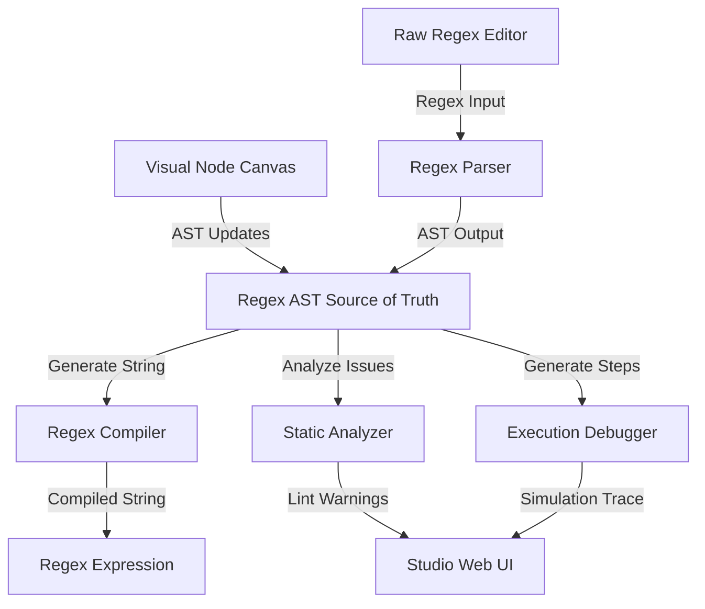

# Regex Studio Architecture

Regex Studio is a professional, visual regular expression designer, compiler, and interactive debugger. It is built as an offline-first, client-only application with zero server dependencies, providing immediate feedback with complete data privacy.

## Core Design Philosophy

1. **Local-First & Client-Only**: All operations (parsing, compiling, analyzing, and debugging) occur directly inside the user's browser (or worker threads). There is no remote backend, database, or API dependency, nor any authentication layer.
2. **Deterministic Flow**: The application uses a single, robust Abstract Syntax Tree (AST) as the absolute source of truth for regular expressions.
3. **Responsive Visual Editing**: A high-performance canvas allows users to design complex matching expressions visually.

## Architectural Flow

The application manages data through a clean, unidirectional flow:



## Monorepo Layout

The codebase is organized as a Bun monorepo structure to keep core engines distinct from the web application:

```
├── apps/
│   └── web/                   # Main frontend SPA (Vite + React + Tailwind)
└── packages/
    ├── regex-core/            # AST model schemas, validators, and serializers
    ├── regex-parser/          # Regex parser, tokenizer, lexer, and error-recovery
    ├── regex-compiler/        # Multi-language target regex compilation engines
    ├── regex-analyzer/        # Static analysis engine (ReDoS and performance checks)
    ├── regex-debugger/        # Step-by-step regex matching simulation engine
    ├── regex-exporters/       # Source code and framework integrations (Zod, Yup, Ajv)
    ├── storage/               # Offline-first persistence layers (IndexedDB via Dexie)
    ├── stores/                # Global React application state (Zustand stores)
    ├── ui/                    # Reusable React UI component primitives
    ├── flow-engine/           # Visual canvas flow node & edge engine
    └── templates/             # Library of standard regex templates
```

## Package Dependency Principles

- **UI Isolation**: Packages (under `/packages`) are strictly pure TypeScript packages. They must **not** import React or render UI directly (with the sole exception of the shared primitives in `@regex-studio/ui`).
- **Single Source of Truth**: `@regex-studio/regex-core` defines the AST Node TypeScript types, validating schemas, and version schemas. All other modules depend on `regex-core` as their core dependency.
- **Directional Imports**: No package may import from `@regex-studio/web`. Circular dependencies are prohibited.
